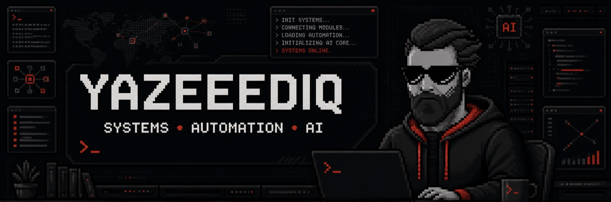
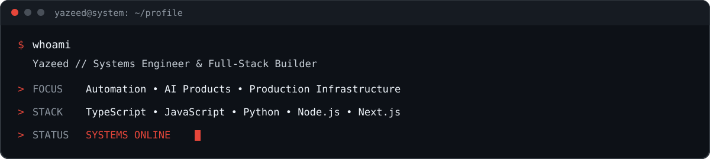

<div align="center">
  
</div>

<div align="center">
  
</div>

<div align="center">
  <a href="https://yazeediq.pro"></a>
  <a href="https://github.com/YazeediQ"></a>
  
</div>

<br />

<div align="center">
  
</div>

## `01 // SYSTEM PROFILE`

I build production-ready web systems, automation workflows, AI-assisted products, dashboards, and backend services. My work lives where software engineering meets operations: turning complex requirements into reliable systems that people can actually use.

```yaml
operator: Yazeed
handle: YazeediQ
mode: build -> deploy -> monitor -> improve
focus:
  - Full-stack products
  - AI-assisted systems
  - Workflow automation
  - Bots and integrations
  - Production infrastructure
```

## `02 // TECH MATRIX`

<div align="center">

### Core


### Products


### Operations


</div>

## `03 // BUILD MODE`

<table>
  <tr>
    <td width="50%">
      <h3>AI Products</h3>
      <p>Practical AI features, intelligent assistants, analysis tools, and human-centered workflows.</p>
    </td>
    <td width="50%">
      <h3>Automation</h3>
      <p>Bots, integrations, task orchestration, notifications, and operational tooling.</p>
    </td>
  </tr>
  <tr>
    <td width="50%">
      <h3>Web Systems</h3>
      <p>Full-stack platforms, internal tools, dashboards, APIs, and polished interfaces.</p>
    </td>
    <td width="50%">
      <h3>Infrastructure</h3>
      <p>Linux deployments, reverse proxies, process management, SSL, monitoring, and reliability.</p>
    </td>
  </tr>
</table>

## `04 // ACTIVITY SIGNAL`

<div align="center">
  
</div>

## `05 // CURRENT MISSION`

```text
[+] Ship useful products
[+] Automate repetitive operations
[+] Design systems that stay maintainable
[+] Turn AI capabilities into real workflows
[+] Keep production calm, observable, and reliable
```

<div align="center">
  <br />
  <samp>END OF TRANSMISSION // YAZEEDIQ</samp>
  <br /><br />
  <a href="https://yazeediq.pro"><strong>yazeediq.pro</strong></a>
</div>
